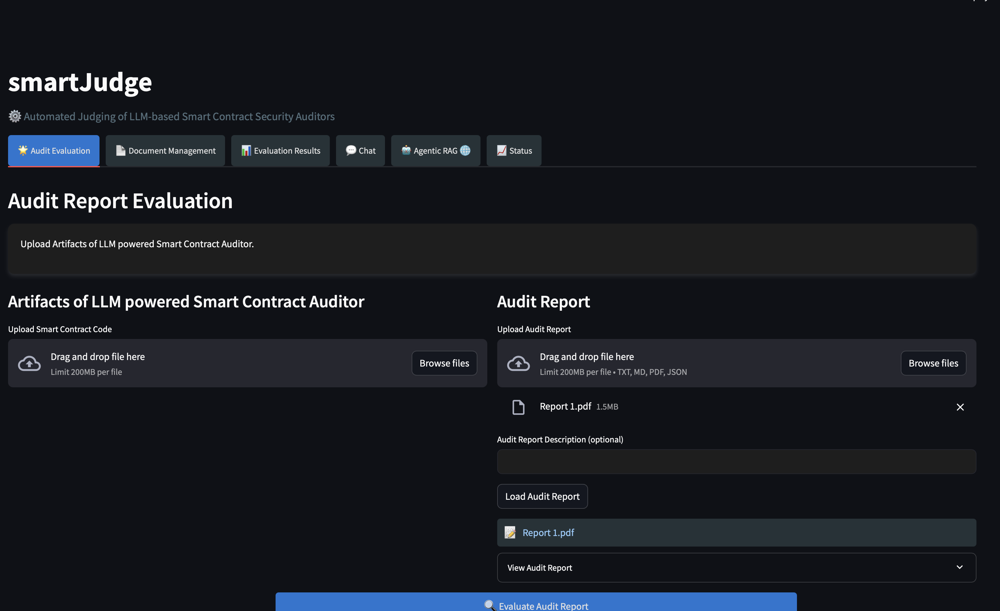

# **Automated Judging of LLM-based Smart Contract Security Auditors**

  

High resolution Demo

## Evaluation Rubric

Each metric is rated on a 4-point scale:

- 🟩🟩🟩🟩 (4.0) - Exemplary
- 🟨🟨🟨 (3.0) - Proficient
- 🟧🟧 (2.0) - Developing
- 🟥 (1.0) - Needs Improvement

### 1. Vulnerability Detection

| Metric | 🟩🟩🟩🟩 |  🟨🟨🟨 | 🟧🟧 | 🟥 |
|--------|-------|-----|----|----|
| Precision | > 95% correct identifications | 85-95% correct | 70-85% correct | < 70% correct |
| Recall | > 95% vulnerabilities found | 85-95% found | 70-85% found | <70% found |
| False Positive Rate | <5% false positives | 5-10% false positives | 10-20% false positives | > 20% false positives |
| Detection Coverage | Covers all known vulnerability types | Covers most (> 80%) known types | Partially covers (50-80%) known types | Covers few (< 50%) known types |

### 2. Advanced Efficiency

| Metric | 🟩🟩🟩🟩 |  🟨🟨🟨 | 🟧🟧 | 🟥 |
|--------|-------|-----|----|----|
| Resource Utilization | Minimal overhead at all complexity levels | Slight overhead at higher complexities | Noticeable overhead at moderate complexities | Significant overhead even at low complexity |
| Multi-Contract Scaling | Near linear scaling, negligible degradation | Moderate performance degradation at large scale | Significant degradation at moderate scale | Severe degradation early on |
| Memory Optimization | Consistently low memory footprint | Occasionally spikes under heavy load | Frequent moderate memory spikes | Persistent high memory usage |
| API Call Efficiency | Minimal calls per contract, highly optimized | Slightly above minimal calls | Moderate overhead in API calls | Excessive and inefficient API calls |

### 3. Novel Pattern Detection

| Metric | 🟩🟩🟩🟩 |  🟨🟨🟨 | 🟧🟧 | 🟥 |
|--------|-------|-----|----|----|
| Zero Day Discovery | Regularly discovers previously unknown vulnerabilities | Occasionally identifies new vulnerabilities | Rarely uncovers new vulnerabilities | Fails to discover anything beyond known vulnerabilities |
| Pattern Evolution | Consistently detect evolving patterns | Usually catches pattern changes | Often misses subtle pattern shifts | Rarely detects any pattern evolution |
| Exploit Chain Identification | Routinely reveals complex exploit chains | Identifies some complex chains | Usually only detects simpler exploits | Misses complex exploit chains consistently |
| Attack Vector Prediction | High accuracy in forecasting likely attacks | Moderate predictive accuracy | Limited predictive capability | Poor or no predictive accuracy |

### 4. Implementation Framework

| Metric | 🟩🟩🟩🟩 |  🟨🟨🟨 | 🟧🟧 | 🟥 |
|--------|-------|-----|----|----|
| Test Harnesses | Fully automated, reproducible tests used consistently | Mostly standardized tests, minor manual adjustments | Inconsistent harness use, partial automation | Ad hoc testing, no standardized harnesses |
| Reproducible Environments | Highly consistent, reproducible test setups | Mostly reproducible setups with rare discrepancies | Infrequently reproducible, occasional environment drift | Unreliable, non-reproducible environments |
| Version Control | Tight version control with clear benchmark evolution | Reasonably tracked versions, minor gaps | Inconsistent version tracking | Poor or no version tracking |

### 5. Explanation Quality

| Metric | 🟩🟩🟩🟩 |  🟨🟨🟨 | 🟧🟧 | 🟥 |
|--------|-------|-----|----|----|
| Clarity and Coherence | Explanations are clear, concise, and logically structured | Generally clear explanations with minor confusion | Some clarity issues, requires effort to understand | Confusing, disorganized explanations |
| Root Cause Identification | Accurately identifies the true cause of vulnerabilities | Usually correct root cause analysis | Sometimes misattributes causes | Rarely identifies correct root causes |
| Remediation Advice | Offers practical, actionable remediation steps | Generally useful advice with some gaps | Generic or partially useful advice | Little to no practical remediation guidance |

### 6. Coverage Analysis

| Metric | 🟩🟩🟩🟩 |  🟨🟨🟨 | 🟧🟧 | 🟥 |
|--------|-------|-----|----|----|
| Code Component Coverage | Analyzes nearly 100% of the codebase | Analyzes majority (>80%) of code components | Partial coverage (50-80%) | Limited coverage (<50%) |
| Cross Contract Analysis | Thorough inter contract vulnerability detection | Moderate success detecting cross contract issues | Occasionally identifies cross contract issues | Rarely or never detects inter contract issues |
| Blind Spot Detection | Almost no missed patterns, excellent blind spot checks | Few missed patterns, generally good coverage | Regularly misses certain pattern types | Many blind spots, misses significant portions |

### 7. Comparative Utility

| Metric | 🟩🟩🟩🟩 |  🟨🟨🟨 | 🟧🟧 | 🟥 |
|--------|-------|-----|----|----|
| Agreement with Human Audits | High correlation (Cohen's Kappa >0.8) | Moderate correlation (Kappa ~0.6-0.8) | Low correlation (Kappa ~0.4-0.6) | Poor agreement (Kappa <0.4) |
| Consistency Across Runs | Highly stable results across multiple runs | Generally stable with minor variance | Noticeable variation between runs | Inconsistent, highly variable outcomes |
| Pattern Generalization | Adapts well to new/unseen patterns | Sometimes adapts, but not consistently | Struggles to generalize new patterns | Fails to generalize beyond trained scenarios |

### 8. Operational Efficiency

| Metric | 🟩🟩🟩🟩 |  🟨🟨🟨 | 🟧🟧 | 🟥 |
|--------|-------|-----|----|----|
| Scalability | Maintains performance even at large scale | Slight performance drop at large scale | Significant drop at moderate scale | Not scalable, performance fails at scale |
| Error Handling | Recovers gracefully from errors, minimal downtime | Handles most errors with some user intervention | Error recovery is hit or miss | Poor error handling, frequent breakdowns |
| System Integration | Integrates smoothly with various tools and pipelines | Usually integrates with some adjustments | Integration is challenging, frequent fixes needed | Difficult or impossible to integrate effectively |

## Performance Levels

Overall scores are calculated by averaging the ratings across all metrics:

- **Exemplary (>95%)**: Demonstrates exceptional capability and reliability
- **Proficient (85%-95%)**: Shows strong performance with minor areas for improvement
- **Developing (70%-84%)**: Exhibits basic competency with significant room for enhancement
- **Needs Improvement (<70)**: Requires substantial improvement in multiple areas
